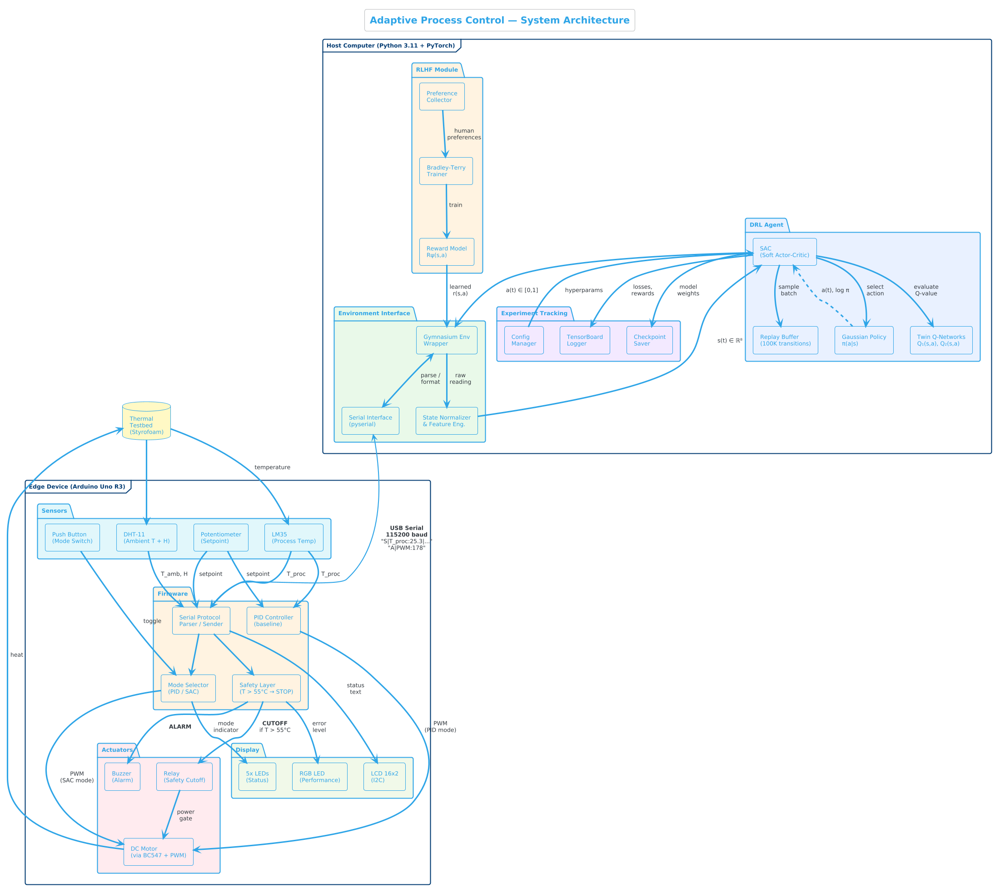
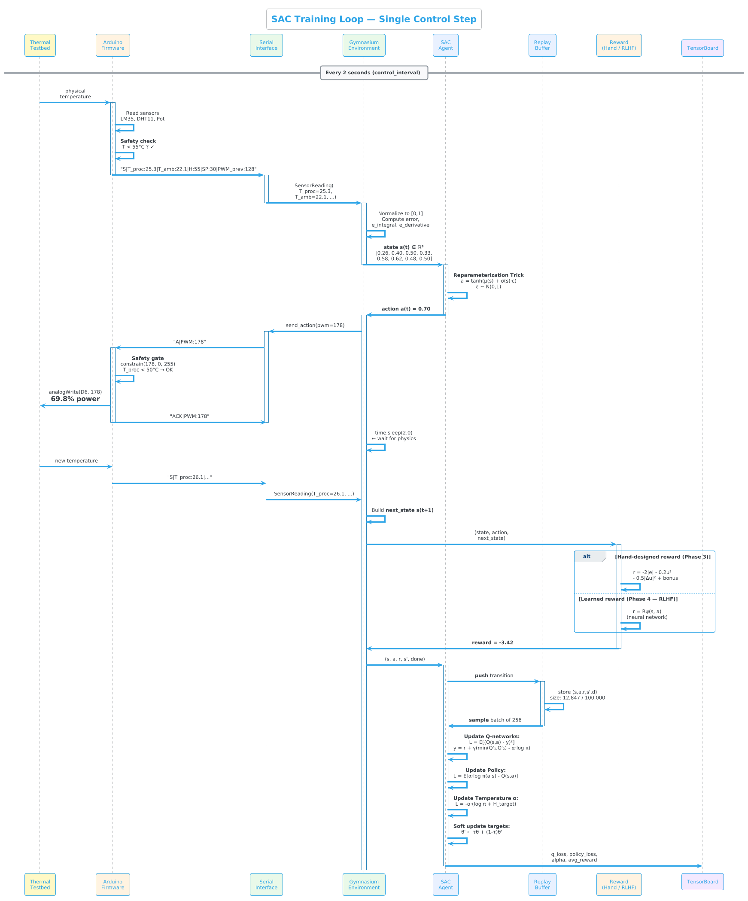
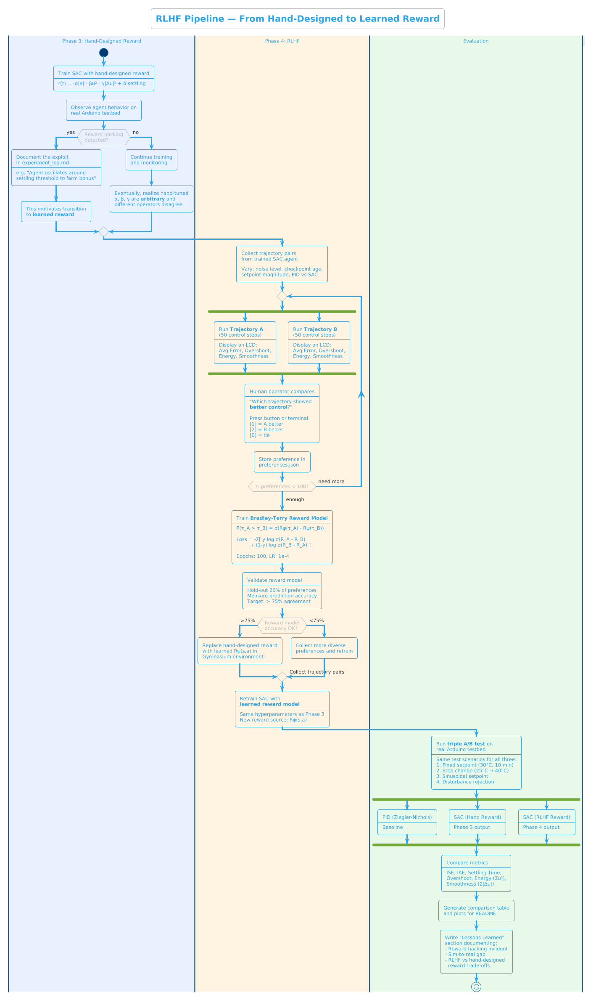

# System Architecture

## 1. Component Overview

The system consists of two main layers: a Python host running the
DRL agent and RLHF module, and an Arduino edge device handling
real-time sensor reading and actuation with an independent safety layer.

## 2. Training Loop

Each control step follows a strict sequence: sensor reading →
state normalization → action selection → safety-gated actuation →
physics delay → reward computation → buffer storage → network update.

## 3. RLHF Pipeline

The project transitions from hand-designed rewards (Phase 3) to
human-preference-learned rewards (Phase 4) using the Bradley-Terry
model, motivated by observed reward hacking in Phase 3.

## 4. Hardware Pin Map

| Pin | Component | Direction | Purpose |
|-----|-----------|-----------|---------|
| A0  | LM35      | IN        | Process temperature |
| A1  | Pot       | IN        | Setpoint control |
| A4  | LCD SDA   | I2C       | Display data |
| A5  | LCD SCL   | I2C       | Display clock |
| D2  | DHT-11    | IN        | Ambient temp + humidity |
| D3  | Button    | IN        | PID/SAC mode toggle |
| D6  | Motor     | OUT (PWM) | Heater control |
| D7  | Relay     | OUT       | Safety power cutoff |
| D8  | Buzzer    | OUT       | Temperature alarm |

## 5. Communication Protocol